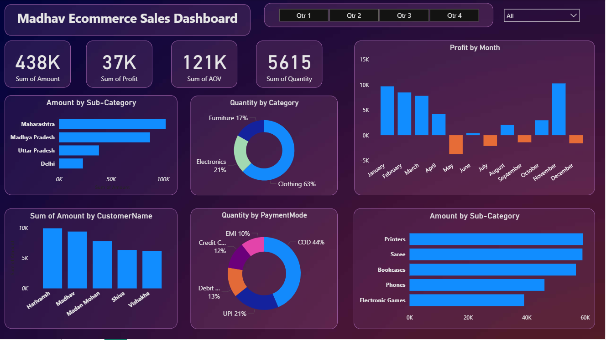
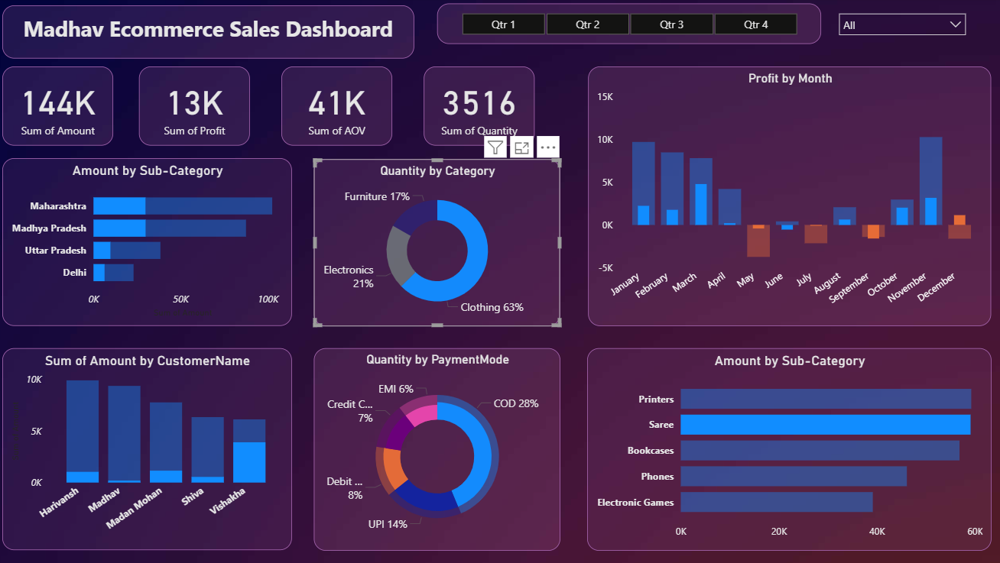
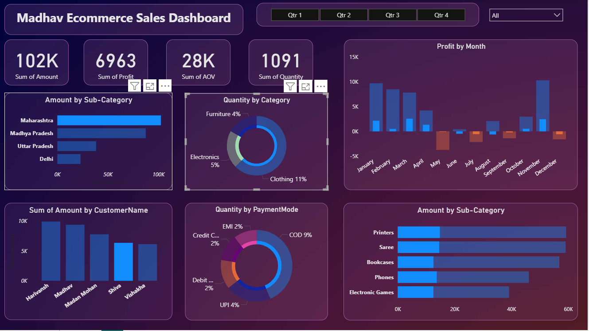
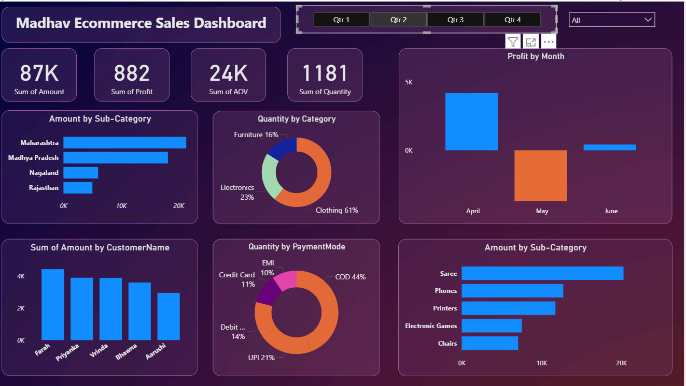

# Madhav Ecommerce Sales Dashboard
## Power BI Project

## Overview
This project is an interactive Power BI dashboard created to track, analyze, and visualize online sales data.

The dashboard provides business insights through dynamic visualizations, filters, slicers, and user-driven analysis features.

---
## Dashboard Preview   

## Key Features
- Interactive sales dashboard
- Drill-down analysis using filters and slicers
- User-driven parameter customization
- Data modeling and table relationships
- KPI and trend analysis
- Multiple customized visualizations

---

## Visualizations Used
- Bar Chart
- Donut Chart
- Slicers and Filters

---

## Data Processing
- Created connections between multiple tables
- Performed joins and calculations for data manipulation
- Used calculated fields and parameters for dynamic reporting

---

## Tools & Technologies
- Power BI
- Data Visualization
- Data Modeling
- CSV Dataset

---

## Project Insights
This dashboard helps in:
- Maharashtra generated the highest sales amount among all states.
- Clothing category contributed the largest share of total quantity sold (63%).
- COD (Cash on Delivery) was the most preferred payment method by customers.
- Profit trends showed strong performance during January, February, and December.
- Some months recorded negative profit, indicating possible seasonal loss periods.
- Printers and Sarees were among the top-performing sub-categories by sales amount.
- Customer-wise sales analysis helped identify high-value customers contributing significantly to revenue.
- Interactive filters and slicers enabled dynamic drill-down analysis across quarters and categories.

---

## Files Included
- `msed_visualization.pbix` — Main Power BI Dashboard File

---

## How to Use
1. Download the `.pbix` file
2. Open it using Power BI Desktop
3. Refresh the dataset if needed

---

## Author
Ruchita Kumbhare

## Acknowledgment

Thanks to Rishabh Mishra for the Power BI tutorial and project guidance shared on YouTube.
